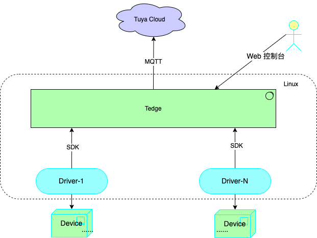

[English](README.md) | [中文版](README_CN.md)
# tuya-tedge-driver-sdk-go：The SDK is used to develop southbound device driver connected to Tedge(Tuya edge gateway).

## Noun
* Tedge: Tuya edge gateway, used to connect the devices to tuya cloud.
* tedge-driver-sdk-go: Driver development sdk, used for the development of Tedge drivers.
* Driver：The Tedge southbound plugin, used to connect devices and Tedge.

## Architecture of the Tedge


## Quck Start

### Driver development steps
1. Reference the "Driver Development Example", developer must implement the interface `DPModelDriver`.
2. Package the driver into a Docker image.
3. For a complete demo, please refer to: [Driver Demo](./docs/summary.md)
4. Driver Development Guide, please refer to: [Driver Development Guide](./docs/summary.md)

### DPModelDriver interface
```golang
type DPModelDriver interface {
	// DeviceNotify  add/update/delete device callback
	DeviceNotify(ctx context.Context, t commons.DeviceNotifyType, cid string, device commons.DeviceInfo) error

	// ProductNotify add/update/delete product callback
	ProductNotify(ctx context.Context, t commons.ProductNotifyType, pid string, product DPModelProduct) error

	// HandleCommands tuya cloud mqtt message: tuya cloud-->Tedge-->device
	HandleCommands(ctx context.Context, cid string, req CommandRequest, protocols map[string]commons.ProtocolProperties, dpExtend DPExtendInfo) error

	Stop(ctx context.Context) error
}
```

### Driver Development Example
```golang
package main

import (
	"context"
	"fmt"

	"github.com/tuya/tuya-tedge-driver-sdk-go/commons"
	"github.com/tuya/tuya-tedge-driver-sdk-go/dpmodel"
	"github.com/tuya/tuya-tedge-driver-sdk-go/service"
)

//TEdge Driver Development Example
func main() {
	sdkLog := commons.DefaultLogger(commons.DebugLevel, "driver-example")
	dpService := service.NewDPService(sdkLog)

	// DP model driver
	dpDriver := NewDemoDPDriver(dpService)
	go dpDriver.Run()

	//Note：dpDriver must implement `type DPModelDriver interface`
	//Start: blocked
	err := dpService.Start(dpDriver)
	if err != nil {
		sdkLog.Errorf("tedge-driver start err:%s", err)
		panic(fmt.Sprintf("tedge-driver start err:%s", err))
	}
}

// DemoDpDriver must implement `type DPModelDriver interface`
// DPModelDriver is defined in sdk：`tedge-driver-sdk-go/dpmodel/interface.go`
type DemoDPDriver struct {
	dpService *service.DPDriverService
}

func NewDemoDPDriver(dpService *service.DPDriverService) *DemoDPDriver {
	return &DemoDPDriver{
		dpService: dpService,
	}
}

/////////////////////////////////////////////////////////////////////////////////////////////////////
//DPModelDriver interface implementation
//1.Receive mqtt message to device from Tuya cloud
//2.Note: Don't blocked!
func (dd *DemoDPDriver) HandleCommands(ctx context.Context, cid string, msg dpmodel.CommandRequest, protocols map[string]commons.ProtocolProperties, dpExtend dpmodel.DPExtendInfo) error {
	//......
	//TODO: implement me

	return nil
}

//DPModelDriver interface implementation
//1.This interface is callbacked by the Tedge, when Add/Active/Update/Delete a sub device on Tedge Web.
//2.Note: Don't blocked!
func (dd *DemoDPDriver) DeviceNotify(ctx context.Context, action commons.DeviceNotifyType, cid string, device commons.DeviceInfo) error {
	//......
	//TODO: implement me
    //Send message to the real device

	return nil
}

//DPModelDriver interface implementation
//1.This interface is callbacked by the Tedge, when Add/Update/Delete a product on Tedge Web.
//2.Note: Don't blocked!
func (dd *DemoDPDriver) ProductNotify(ctx context.Context, t commons.ProductNotifyType, pid string, product dpmodel.DPModelProduct) error {
	return nil
}

//DPModelDriver interface implementation
//1.This interface is callbacked by the Tedge, when the driver is stoped.
func (dd *DemoDPDriver) Stop(ctx context.Context) error {
	return nil
}

//Custom Implementation
func (dd *DemoDPDriver) Run() {
	//......
}
```

### Implementation driver with mqtt

```golang
type MqttDriver struct {
	logger commons.TedgeLogger
}

func NewMqttDriver(l commons.TedgeLogger) *MqttDriver {
	return &MqttDriver{
		logger: l,
	}
}

var _ commons.MqttDriver = (*MqttDriver)(nil)

// Auth mqtt auth event, return true if the verification is passed.
func (md *MqttDriver) Auth(clientId, username, password string) (bool, error) {
	md.logger.Debugf("auth: clientId: %s, username: %s, password: %s", clientId, username, password)
	return true, nil
}

// Sub mqtt subscribe event, return true if the verification is passed.
func (md *MqttDriver) Sub(clientId, username, topic string, qos byte) (bool, error) {
	md.logger.Debugf("sub: clientId: %s, username: %s, topic: %s, qos: %d", clientId, username, topic, qos)
	return true, nil
}

// Pub mqtt publish event, return true if the verification is passed.
func (md *MqttDriver) Pub(clientId, username, topic string, qos byte, retained bool) (bool, error) {
	md.logger.Debugf("pub: clientId: %s, username: %s, topic: %s, qos: %d, retained: %t", clientId, username, topic, qos, retained)
	return true, nil
}

// UnSub mqtt unsubscribe event
func (md *MqttDriver) UnSub(clientId, username string, topics []string) {
	md.logger.Debugf("unsub: clientId: %s, username: %s, topics: %+v", clientId, username, topics)
}

// Connected mqtt connect event
func (md *MqttDriver) Connected(clientId, username string) {
}

// Closed
func (md *MqttDriver) Closed(clientId, username string) {
	md.logger.Debugf("clised: clientId: %s, username: %s", clientId, username)
}

func (md *MqttDriver) OnConnectedHandler() mqtt.OnConnectHandler {
	return func(client mqtt.Client) {
		topic := "tuya/tedge/custom/test1"
		md.logger.Debugf("sub topic(%s) ...", topic)
		if token := client.Subscribe(topic, byte(1), md.OnMessageReceived()); token.Wait() && token.Error() != nil {
			panic(token.Error())
		}
		md.logger.Debugf("sub topic(%s) success", topic)
	}
}

func (md *MqttDriver) OnMessageReceived() mqtt.MessageHandler {
	return func(client mqtt.Client, message mqtt.Message) {
		md.logger.Debugf("Received message on topic: %s, Message: %s", message.Topic(), message.Payload())
		client.Publish("tuya/tedge/custom/test2", byte(1), false, message.Payload())
	}
}
```

## SDK API
* DP Model SDK API: `tedge-driver-sdk-go/service/dpmodelapi.go`
* TuyaLink Model SDK API: `tedge-driver-sdk-go/service/tymodelapi.go`

## Technical Support
Tuya IoT Developer Platform: https://developer.tuya.com/en/

Tuya Developer Help Center: https://support.tuya.com/en/help

Tuya Work Order System: https://service.console.tuya.com/
